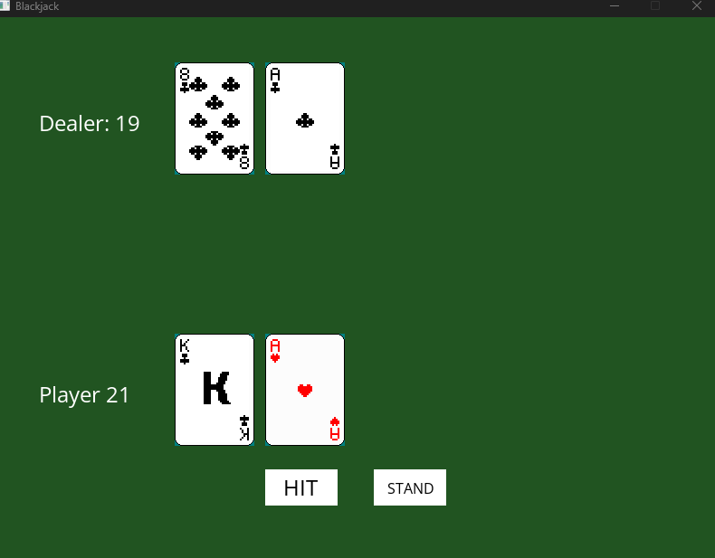

# Blackjack

A 2D Blackjack game built with C++ and SDL3, developed as a portfolio project to demonstrate systems programming, game architecture, and graphics programming fundamentals.

  


## Download & Play

**Windows:** Download the latest release from the [Releases](https://github.com/amart26/Blackjack/releases) page, extract the zip, and run `blackjack.exe`.

## Features

- Full 52 card deck with Fisher-Yates shuffle
- Blackjack scoring with proper Ace logic (1 or 11)
- Dealer AI following standard casino rules (hits on 16, stands on 17)
- Game state machine managing player turn, dealer turn, and game over
- SDL3 2D rendering with sprite sheet card graphics
- Live player and dealer score display
- Clickable Hit, Stand, and Play Again buttons
- Bust and Blackjack detection
- Clean multi-file architecture separating game logic from rendering

## How to Play

- **Hit** — Draw another card
- **Stand** — End your turn and let the dealer play
- **Play Again** — Reset and start a new round (appears after game ends)

## Tech Stack

- **Language:** C++17
- **Graphics:** SDL3
- **Font Rendering:** SDL3_ttf
- **Image Loading:** SDL3_image
- **Build:** g++ (MinGW on Windows, Clang on macOS)

## Project Structure

```
Blackjack/
├── src/
│   ├── main.cpp        ← game loop and entry point
│   ├── Card.h/.cpp     ← deck, hand, and scoring logic
│   ├── Renderer.h/.cpp ← SDL3 rendering functions
│   └── GameState.h     ← game state enum
├── assets/
│   ├── fonts/
│   │   └── OpenSans.ttf
│   └── images/
│       ├── Hearts.png
│       ├── Diamonds.png
│       ├── Clubs.png
│       └── Spades.png
├── .clang-format
├── .gitignore
└── README.md
```

## Building from Source

### Prerequisites

**Windows:**
- [MinGW-w64](https://winlibs.com)
- [SDL3](https://github.com/libsdl-org/SDL/releases)
- [SDL3_ttf](https://github.com/libsdl-org/SDL_ttf/releases)
- [SDL3_image](https://github.com/libsdl-org/SDL_image/releases)

**macOS:**
```bash
brew install sdl3 sdl3_ttf sdl3_image
```

### Compile

**Windows:**
```bash
g++ src/main.cpp src/Card.cpp src/Renderer.cpp -o blackjack -I"C:\SDL3\x86_64-w64-mingw32\include" -I"C:\SDL3_ttf\x86_64-w64-mingw32\include" -I"C:\SDL3_image\x86_64-w64-mingw32\include" -L"C:\SDL3\x86_64-w64-mingw32\lib" -L"C:\SDL3_ttf\x86_64-w64-mingw32\lib" -L"C:\SDL3_image\x86_64-w64-mingw32\lib" -lSDL3 -lSDL3_ttf -lSDL3_image
```

**macOS:**
```bash
g++ src/main.cpp src/Card.cpp src/Renderer.cpp -o blackjack -I/opt/homebrew/opt/sdl3/include -I/opt/homebrew/opt/sdl3_ttf/include -I/opt/homebrew/opt/sdl3_image/include -L/opt/homebrew/opt/sdl3/lib -L/opt/homebrew/opt/sdl3_ttf/lib -L/opt/homebrew/opt/sdl3_image/lib -lSDL3 -lSDL3_ttf -lSDL3_image
```

### Run

**Windows:**
```bash
.\blackjack.exe
```

**macOS:**
```bash
./blackjack
```

## Concepts Demonstrated

- Object-oriented design with structs and enums
- Dynamic memory management with vectors
- SDL3 game loop architecture
- Event-driven input handling
- State machine pattern for game flow
- Sprite sheet rendering with source rectangles
- Multi-file C++ project structure
- Cross-platform development

## Roadmap

- [ ] Chip and betting system
- [ ] Win/loss message on screen
- [ ] Sound effects
- [ ] macOS release

## License

MIT